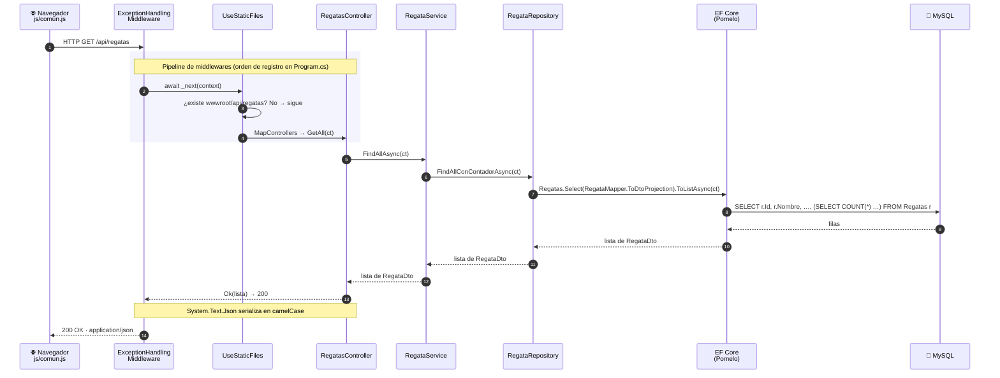

# Arquitectura por capas — Marina API

Documento vivo: qué hace cada capa del backend de MarinaApi, por qué existe y qué se ve desde el frontend cuando falla. Nace con el ticket #171 (frontend de solo lectura), cuyo objetivo real no son las tablas sino **entender cómo se conecta el frontend con el backend y la importancia de cada capa**. Se amplía con cada experimento; no se reescribe.

Relacionado: [[Guía definitiva de CSharp#Lección 11: Arquitectura de backend en capas|Lección 11 de la guía]] (teoría general) · [[Migración de Java a CSharp]] (equivalencias con Spring) · [[Glosario CSharp]] (términos sueltos).

---

## 1. El recorrido de una petición

Lo que ocurre cuando `regatas.html` ejecuta `obtenerDatos("/api/regatas")`, desde el `fetch` del navegador hasta MySQL **y de vuelta**:

Para no cargar el diagrama se omiten otros middlewares del pipeline (`UseDefaultFiles`, `UseCors`, `UseHttpsRedirection`, `UseAuthorization`). La respuesta vuelve a atravesarlos en **orden inverso**, y `System.Text.Json` convierte los nombres a camelCase (`TotalBarcosInscritos` → `totalBarcosInscritos`), que es lo que lee `respuesta.json()`.

**En Java/Spring** el recorrido es el mismo con otros nombres: filtros del servlet → `DispatcherServlet` → `@RestController` → `@Service` → `JpaRepository` → Hibernate → base de datos, y Jackson para el JSON.

---

## 2. Las capas, una a una

### 2.1 Middleware — la puerta de entrada y salida

- **Qué hace:** cada petición atraviesa los middlewares registrados en `Program.cs`, en orden, a la ida y a la vuelta. `ExceptionHandlingMiddleware` envuelve todo lo demás en un `try/catch`: `NotFoundException` → 404, `ConflictException` → 409, cualquier otra → 500 con un mensaje genérico (el detalle solo va al log).
- **Equivalente en Spring:** `@ControllerAdvice` + `@ExceptionHandler`, y la cadena de `Filter` del servlet para el orden.
- **Sin ella:** el frontend recibiría errores con formatos distintos según dónde fallara, o un 500 con la traza interna. Con ella, `mostrarMensaje` siempre puede leer un `detail` en el mismo formato.
- **El orden importa:** va registrado el primero para envolver a todos los demás. `UseDefaultFiles` tiene que ir antes que `UseStaticFiles` por la misma razón (ver [[Guía definitiva de CSharp#10.6 Middleware: tratamiento global de errores|10.6 Middleware]]).

### 2.2 Controller — la frontera HTTP

- **Qué hace:** traduce HTTP a C# y de vuelta: ruta, verbo, parámetros (`{id:long}`), cuerpo (`[FromBody]`) y código de estado (`Ok`, `CreatedAtAction`, `NoContent`). **No decide nada de negocio**: cada método de `RegatasController` se limita a llamar al Service y elegir el código de respuesta.
- **Equivalente en Spring:** `@RestController`, `@GetMapping`, `ResponseEntity`.
- **Sin él:** no hay URL que llamar. Es lo único del backend que el frontend conoce.
- **Detalle:** no hay `if (regata == null) return NotFound()`. El Service lanza `NotFoundException` y el Middleware la convierte en 404.

### 2.3 DTO — el contrato con el frontend

- **Qué hace:** define exactamente qué datos salen y entran. `RegataDto` tiene 6 campos planos; la entidad `Regata` tiene además la navegación `Barcos`, que a su vez tiene `Regatas`…
- **Equivalente en Spring:** DTO / `record` de Java.
- **Sin él:** el frontend recibiría la entidad entera, con ciclos Barco ↔ Regata (error de serialización o JSON infinito) y campos internos. Cualquier cambio en la base de datos rompería el frontend.
- **Ejemplo real:** `totalBarcosInscritos` no existe en la base de datos. Es un dato calculado que el DTO ofrece al frontend. Ver [[Migración de Java a CSharp#12. DTOs y Mapper|12. DTOs y Mapper]].

### 2.4 Service — las reglas de negocio

- **Qué hace:** decide qué se puede hacer y qué no. `RegataService.FindByIdAsync` lanza `NotFoundException` si no existe; `AmarreService` lanza `ConflictException` si el amarre ya está ocupado; `InscribirBarcoAsync` no inscribe dos veces el mismo barco.
- **Equivalente en Spring:** `@Service`.
- **Sin él:** las reglas acabarían en el Controller o, peor, en el JavaScript, donde cualquiera puede saltárselas llamando a la API directamente (con Swagger, Postman o `curl`). **El frontend puede ayudar al usuario, pero la regla tiene que vivir en el backend.**
- Ver [[Migración de Java a CSharp#10. Capa de Servicio|10. Capa de Servicio]].

### 2.5 Repository — cómo se piden los datos

- **Qué hace:** encapsula las consultas LINQ. El Service pide "todas las regatas con su contador" sin saber cómo se construye la consulta.
- **Equivalente en Spring:** `JpaRepository` y sus métodos derivados (`findByLugar`).
- **Sin él:** el Service mezclaría reglas de negocio con detalles de EF Core, y los tests del Service no podrían usar un mock (`Mock<IRegataRepository>`).
- **Ejemplo real — el bug de `totalBarcosInscritos = 0`:** el frontend mostraba un 0 perfectamente formado. El fallo estaba cuatro capas más abajo: el Repository no cargaba `Barcos`, y EF Core devuelve la colección vacía sin avisar (Hibernate habría lanzado `LazyInitializationException`). Se resolvió en esta capa con una proyección a DTO que EF Core traduce a un `COUNT(*)`. Ver [[Guía definitiva de CSharp#8.7 Change tracking, AsNoTracking y el problema N+1|8.7 N+1]].

### 2.6 DbContext + EF Core — del objeto al SQL

- **Qué hace:** traduce LINQ a SQL del motor concreto (Pomelo para MySQL), abre la conexión, materializa las filas en objetos y registra cambios para `SaveChangesAsync`.
- **Equivalente en Spring:** `EntityManager` / Hibernate con su dialecto.
- **Sin él:** SQL escrito a mano y mapeo de columnas a propiedades uno a uno (ADO.NET, el JDBC de .NET).

---

## 3. Dónde MarinaApi se salta la regla (y por qué importa)

Dos atajos reales del código actual, para saber reconocerlos en un code review:

1. **`RegataService` recibe `MarinaDbContext` directamente** y llama a `_context.SaveChangesAsync` en `InscribirBarcoAsync`. El Service depende así de EF Core, la capa que el Repository debía esconder. Lo resuelve el patrón Unit of Work (ticket #158 del backlog).
2. **`IRegataRepository` devuelve `RegataDto`** (`FindAllConContadorAsync`). Se hizo así para que EF Core generase el `COUNT(*)` en SQL, pero el Repository conoce ahora el contrato del frontend. Es un compromiso habitual (rendimiento frente a pureza de capas) y conviene saber que lo es.

---

## 4. Experimentos

Cada experimento hace visible una capa desde el frontend. Formato: qué se hizo, qué se vio y qué demuestra.

| # | Experimento | Capa | Resultado |
|---|---|---|---|
| 1 | Cambiar la URL del `fetch` a `/api/barcosXX` | Middleware / enrutado | Aviso rojo "La API respondió 404": `fetch` no lanza error con un 404; hay que comprobar `respuesta.ok`. Ninguna ruta coincide, así que ni se llega al Controller. |
| 2 | Pestaña Network (F12): petición y respuesta crudas | Controller / DTO | *Pendiente* |
| 3 | Log de SQL en la consola de la API al cargar Regatas | Repository / EF Core | *Pendiente* |
| 4 | `GET /api/regatas/9999` frente a `/api/regatasXX` | Service + Middleware | *Pendiente* |
| 5 | Tripulantes: mostrar el nombre del barco (dos `fetch` o cambiar el DTO) | DTO / responsabilidad de cada capa | *Pendiente* |
